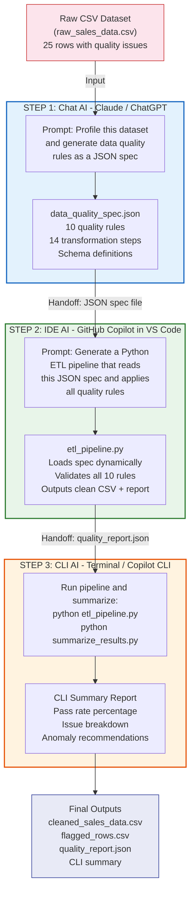

# AI-Powered Data Quality Pipeline — Workflow Diagram

## Workflow Legend

| Step | AI UX Type | Tool | Input | Output (Handoff) |
|------|-----------|------|-------|-------------------|
| **Step 1** | Chat AI | Claude / ChatGPT | Raw CSV + prompt | data_quality_spec.json |
| **Step 2** | IDE AI | GitHub Copilot (VS Code) | JSON spec from Step 1 | etl_pipeline.py + summarize_results.py |
| **Step 3** | CLI AI | Copilot in Terminal | Pipeline execution | CLI summary + cleaned outputs |
